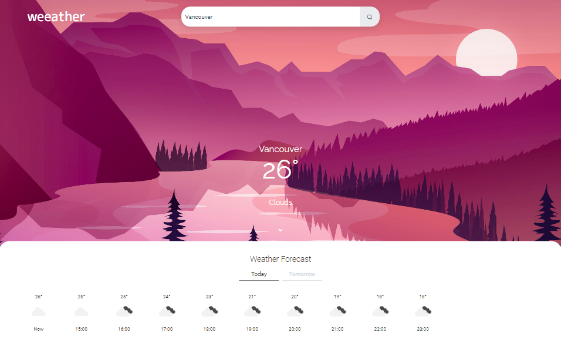

<h1 align="center">WEEATHER 🌩</h1>
<h3 align="center">WEATHER FORECAST APP</h3>

 

    

 

#### RELEASE NOTES: V1.0.0:
- First version of the project 🎉
- See if the weather won't spoil your weekend party!
- Current information of your city and others
- Forecast options: "today" and "tomorrow"

 

#### THIRD-PARTY CREDITS:
- <a href="https://www.freepik.com/author/brgfx">Creator of the dawn illustration: brgfx (freepik)</a>
- <a href="https://www.freepik.com/author/jcomp" target="_blank">Creator of the day illustration: jcomp (freepik)</a>
- <a href="https://www.wallpaperflare.com/vector-landscape-forest-mountains-sunset-wallpaper-ybzax" target="_blank">Website where the image of the afternoon was taken (wallpaper flare)</a>
- <a href="https://www.vecteezy.com/free-vector/nature">Website that provided the image of the night (vecteezy)</a>

 

#### TECHNOLOGIES:
- HTML 📄
- CSS 🎨
- JAVASCRIPT 💻

 

Felipe Macci
